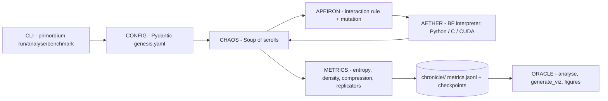

# PRIMORDIUM

[](https://github.com/ArchishmanSengupta/primordium/actions/workflows/ci.yml)
[](LICENSE)
[](https://www.python.org/downloads/)
[](https://github.com/astral-sh/ruff)
[](https://arxiv.org/abs/2406.19108)

**Open-source symbiogenetic computation framework** — reproduce and extend the
Brainfuck "primordial soup" experiment from
[*Computational Life: How Well-formed, Self-replicating Programs Emerge from Simple Interaction*](https://arxiv.org/abs/2406.19108)
(Agüera y Arcas et al., 2024).


A soup of random byte-tapes executes, merges and copies itself with **no
mutation and no fitness function**. Selection is thermodynamic: programs
that copy get copied more. After enough interactions the soup is meant to
gel — entropy drops, replicators take over, and the run prints
`*** LIFE EMERGED ***`.

Read the [technical report](docs/REPORT.md) for the science, architecture,
results and current research landscape.

## How it works

Two scrolls are selected at random, concatenated into one tape, executed as
Brainfuck, and split back in half:

```
   scroll i                 scroll j
   ┌────────┐               ┌────────┐
   │ 48 B   │    concat     │ 48 B   │
   └───┬────┘ ────────────► └───┬────┘
       └───────────┬───────────┘
             ┌─────▼──────┐
             │  96 B tape │   run BF interpreter
             │  ip=0 dp=0 │   (≤ max_steps)
             └─────┬──────┘
       ┌───────────┴───────────┐
  ┌────▼─────┐            ┌────▼─────┐
  │ scroll i'│            │ scroll j'│   split at midpoint,
  └──────────┘            └──────────┘   write back to soup
```

The instruction set is a unified-tape Brainfuck variant — code and data share
the same memory, so programs modify themselves as they run:

| Byte | Op | Meaning |
|------|----|---------|
| `>` 62 | move right | data pointer +1 (wraps) |
| `<` 60 | move left | data pointer −1 (wraps) |
| `+` 43 | increment | cell +1 mod 256 |
| `-` 45 | decrement | cell −1 mod 256 |
| `[` 91 | loop start | jump past matching `]` if cell = 0 |
| `]` 93 | loop end | jump back to matching `[` if cell ≠ 0 |
| `.` 46 | **copy** | copy current cell to the next cell |
| any | no-op | everything else is skipped |

## Architecture



Seven optional evolutionary layers (GENESIS, GAIA, HERMES, MNEMOSYNE,
PROMETHEUS, NOUS, DEMIURGE) are implemented as opt-in research modules and
disabled by default — see
[primordium/FOUNDATION.md](primordium/FOUNDATION.md).

## Quick start

```bash
git clone https://github.com/ArchishmanSengupta/primordium.git
cd primordium
python -m venv .venv
source .venv/bin/activate   # Windows: .venv\Scripts\activate
pip install -e ".[dev]"     # core: numpy + pydantic, no PyTorch needed

primordium validate configs/template_quick.yaml
primordium run configs/template_quick.yaml
```

Or: `bash scripts/run_quick.sh`. Expected: finishes in seconds, writes
`chronicle/quick_test_<timestamp>/` with `metrics.jsonl` and checkpoints.
`Life emerged: False` is normal at 1,000 interactions.

**Emergence runs** (minutes to hours; may print `*** LIFE EMERGED ***`):

```bash
primordium run configs/phase_transition.yaml   # extended default-budget run
primordium run configs/paper_scale.yaml        # paper-aligned budget, see below
```

Optional neural layer (DEMIURGE): `pip install -e ".[neural]"`.

## Results from a 34M-interaction run

Measured on `configs/demo_record_emergence.yaml` (512 scrolls × 64 B,
C backend, ~124K interactions/s). Structure rose and entropy fell, but no
life criteria were met at this step budget:

| Metric | Initial | Final | Life threshold |
|--------|---------|-------|----------------|
| Entropy (bits/byte) | 5.77 | 5.41 | falls during emergence |
| Instruction density | 0.027 | 0.055 | ≥ 0.10 |
| Compression ratio | ~1.17 | ~1.17 | ≤ 0.80 |
| Replication | — | not met | ≥ 5% replicators |


**Why no transition?** The original paper runs 2^17 = 131,072 programs of
64 bytes with a generous per-interaction step budget, and community
replications use `max_steps = 16,384`. This run starved every interaction at
350 steps — copies never complete. `configs/paper_scale.yaml` aligns the
budget with the paper (1,024 scrolls, 16,384 steps/interaction, 50M
interactions). The 2026 follow-up [arXiv:2607.01483](https://arxiv.org/abs/2607.01483)
also shows random background mutation alone finds self-replicators faster
than pairwise interaction — reproducible here via `apeiron.mutation_rate`.

## Life detection

Operational criteria (from the Computational Life experiment):

1. **Structure** — instruction density ≥ 10%
2. **Replication** — ≥ 5% identical copies in the soup
3. **Purpose** — compression ratio ≤ 80%

All three must hold for `*** LIFE EMERGED ***`.

## Performance

Measured with `primordium benchmark` (256 scrolls × 48 B, max_steps 350):

| Backend | Speed |
|---------|-------|
| Python | ~25–35K int/s |
| C | ~125K int/s |
| CUDA | varies (GPU) |

Soup metrics are vectorized with NumPy (3–6× faster per call than the
original pure-Python loops).

## Configs

| File | Purpose |
|------|---------|
| `configs/template_quick.yaml` | Smoke test (1k interactions) |
| `configs/template_full.yaml` | All options documented |
| `configs/phase_transition.yaml` | Long default-budget run |
| `configs/paper_scale.yaml` | Paper-aligned budget (16,384 steps/interaction) |
| `configs/scaling_study.yaml` | Soup size sweep |
| `configs/with_layers.yaml` | Enable optional layers |
| `configs/demo_record*.yaml` | Demo-recording runs (5M–34M) |

## Visualization

After a run:

```bash
python scripts/generate_viz.py chronicle/<your_run_dir>        # self-contained HTML dashboard
python scripts/generate_readme_figures.py chronicle/<run_dir> # PNG metrics figures
primordium analyse chronicle/<your_run_dir>                   # text report
```

See [docs/visualization.md](docs/visualization.md).

## Project layout

```
primordium/          # Python package (aether, chaos, config, metrics, layers, …)
configs/             # YAML experiment templates
scripts/             # run_quick.sh, generate_viz.py, figure generator, …
docs/                # Tech report, guides, figure assets
demo/                # Terminal demo (VHS tape + rendered GIF/MP4)
tests/               # pytest suite
chronicle/           # Run outputs (gitignored)
```

## Development

```bash
pytest tests/ -q
ruff check primordium/ --select E,F,W --ignore E501
primordium validate configs/template_full.yaml
```

See [CONTRIBUTING.md](CONTRIBUTING.md).

## References

- Agüera y Arcas, B., Alakuijala, J., Evans, J., Laurie, B., Mordvintsev, A., Niklasson, E., Randazzo, E., & Versari, L. (2024). *Computational Life: How Well-formed, Self-replicating Programs Emerge from Simple Interaction.* [arXiv:2406.19108](https://arxiv.org/abs/2406.19108)
- Knierim, C., Versari, L., Obryk, R., Agüera y Arcas, B., & Saurous, R. A. (2026). *BFF: Simple explanations for complex phenomena.* [arXiv:2607.01483](https://arxiv.org/abs/2607.01483)
- Cicala, F., Niklasson, E., Randazzo, E., et al. (2026). *Co-evolution of self-replication and function in a digital primordial soup.* [arXiv:2607.09211](https://arxiv.org/abs/2607.09211)
- Margulis, L. (1970). *Origin of Eukaryotic Cells*
- Pross, A. (2005). Stability in chemistry and biology: Life as a kinetic state of matter

## License

MIT — see [LICENSE](LICENSE).
