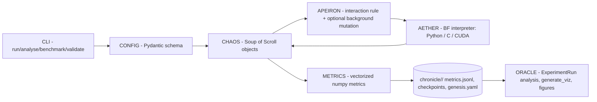
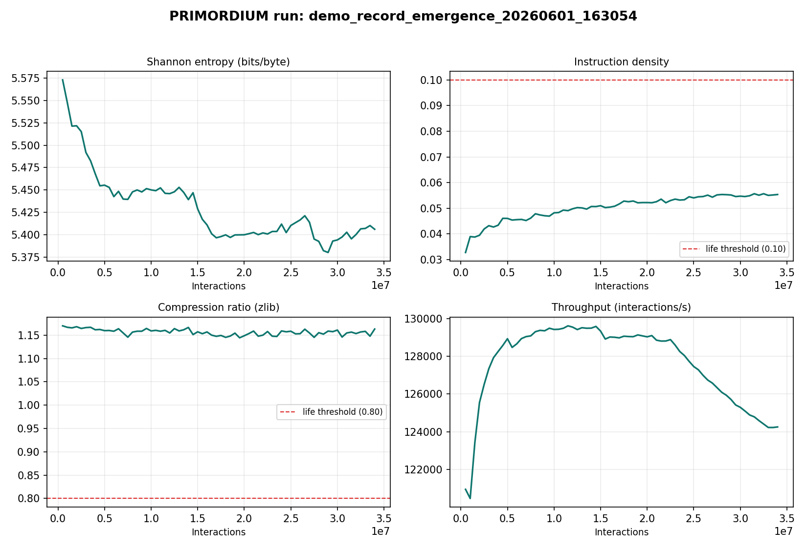
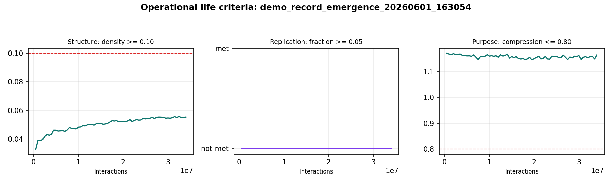

# PRIMORDIUM Technical Report

**Open-source symbiogenetic computation: reproducing and extending the
Computational Life experiment**

September 2026

---

## Contents

1. [Executive summary](#1-executive-summary)
2. [The experiment](#2-the-experiment)
3. [Theoretical background](#3-theoretical-background)
4. [Architecture](#4-architecture)
5. [Metrics and life detection](#5-metrics-and-life-detection)
6. [Results](#6-results)
7. [Research landscape 2024–2026](#7-research-landscape-2024-2026)
8. [Changes in this update](#8-changes-in-this-update)
9. [Roadmap](#9-roadmap)
10. [References](#10-references)

---

## 1. Executive summary

PRIMORDIUM is an open-source reproduction and extension of the
**Computational Life** experiment (arXiv:2406.19108) by Agüera y Arcas,
Alakuijala, Evans, Laurie, Mordvintsev, Niklasson, Randazzo and Versari at
Google. In that experiment, a "primordial soup" of random byte-tapes running
a 7-instruction Brainfuck variant — with **no mutation operator and no
fitness function** — spontaneously produces well-formed self-replicating
programs through random pairwise interaction alone. Selection is purely
thermodynamic: programs that copy get copied more.

This report documents what PRIMORDIUM is, what our own runs show, what the
current research landscape says, and what changed in the September 2026
update.

**Headline findings of this update:**

1. **Our 34M-interaction run did not reach the phase transition — and we
   now know why.** The run starved every interaction at 350 execution steps,
   while the original paper's programs are 64 bytes and community
   replications use 16,384 steps per interaction; the paper itself runs
   2^17 = 131,072 programs. `configs/paper_scale.yaml` now aligns the
   budget with the paper.
2. **The field has moved.** Two 2026 follow-up papers from the original team
   change the picture: random mutation alone finds self-replicators at least
   as fast as pairwise interaction ([arXiv:2607.01483](https://arxiv.org/abs/2607.01483)),
   and self-replication and task-solving co-evolve under metabolic
   constraints ([arXiv:2607.09211](https://arxiv.org/abs/2607.09211)).
   Both directions are now first-class options here (mutation knob, task
   runners).
3. **Two citations in the layer documentation pointed at the wrong papers.**
   State Soup is arXiv:2406.08423 and the mesa-optimization work is
   arXiv:2309.05858; the repo previously cited 2410.13989 and 2410.18636.
   Fixed.

---

## 2. The experiment

### 2.1 Lineage

The experiment is a modern instance of a lineage running through
von Neumann's self-reproducing automata (1966), Fontana's **Turing gas**
(1992) — where programs collide and each executes on the other's output —
and Ray's Tierra / Adami's Avida digital ecologies. The BFF variant
("BrainFuck Friend") strips this down to a minimal substrate where the
distinction between code and data does not exist.

### 2.2 The actual setup (from the paper)

> "A variant of the Turing gas from Fontana. A large number of programs
> (usually 2^17) form a 'primordial soup'. Each program consists of 64
> 1-byte characters which are randomly initialized from a uniform
> distribution. In these simulations, no new programs are generated or
> removed — change only occurs through self-modification or random
> background mutations. In each epoch, programs interact with one another
> by selecting random ordered pairs, concatenating them and executing the
> resulting code for a fixed number of steps or until the program ends."

Key parameters:

| Parameter | Paper | PRIMORDIUM default | paper_scale config |
|---|---|---|---|
| Programs (soup size) | 2^17 = 131,072 | 256 | 1,024 |
| Tape length | 64 bytes | 48 bytes | 64 bytes |
| Interaction | random ordered pair | random unordered pair | random pair |
| Execution budget | fixed steps (large) | 350 steps | 16,384 steps |
| Mutation | background (studied) | optional (`mutation_rate`) | 0.0 (knob documented) |

The instruction set is Brainfuck minus I/O plus a **copy** operation:

| Byte | Op | Semantics |
|------|----|-----------|
| `>` 62 | move | data pointer +1 (wraps) |
| `<` 60 | move | data pointer −1 (wraps) |
| `+` 43 | arithmetic | cell +1 mod 256 |
| `-` 45 | arithmetic | cell −1 mod 256 |
| `[` 91 | control | jump past matching `]` if cell = 0 |
| `]` 93 | control | jump to matching `[` if cell ≠ 0 |
| `.` 46 | **copy** | copy current cell into the next cell |

All other byte values are no-ops. Because the instruction pointer and data
pointer traverse the same tape, every program is a self-modifying program.

### 2.3 The APEIRON interaction rule

```
scroll_i, scroll_j  →  concatenate  →  execute (≤ max_steps)  →  split at
midpoint  →  write both halves back to the soup
```

Nothing else happens. There is no crossover, no elitism, no tournament
selection. If a program's bytes cause a copy of itself (or useful structure)
to end up on the tape, that structure persists and spreads.

---

## 3. Theoretical background

**Symbiogenesis.** Margulis (1970) argued that the major transitions in
evolution — the eukaryotic cell above all — arose by merger of independent
lineages, not by incremental mutation. The BFF soup is a computational
minimal model of merger-driven complexity: concatenation is the only
recombination operator.

**Dynamic kinetic stability.** Pross (2005) reframes evolutionary behavior
as a kinetic phenomenon: far-from-equilibrium systems that reproduce can be
kinetically stable even when thermodynamically fragile. The soup's
"selection" needs no selector — replicators are simply the attractor of a
copy-biased stochastic process.

**Phase transition / gelation.** In the paper, emergence is sudden: after a
critical number of interactions, entropy drops, instruction density and
replicator mass rise together — analogous to gelation in polymer physics,
where cross-linking produces a spanning connected component. PRIMORDIUM's
metrics (below) are designed to catch exactly this transition.

**Compression as a complexity proxy.** Our "purpose" criterion uses zlib
compression ratio. Recent critiques of assembly theory (Marshall et al. and
follow-ups) argue assembly indices collapse to dictionary/LZ compression —
which cuts both ways: it validates LZ-style compression as a cheap
complexity proxy, while cautioning that it cannot distinguish "living" from
merely repetitive structure. See §7.3.

---

## 4. Architecture



| Module | Responsibility |
|---|---|
| `primordium.aether` | The interpreter: `interpreter.py` (pure Python), `engine.py` (C via ctypes), `engine_cuda.py` (CUDA) |
| `primordium.chaos` | `Soup` (population, pairing, interaction, mutation, checkpointing) and `Scroll` (tape + lineage metadata) |
| `primordium.apeiron` | Interaction-rule registry (`StandardRule`) |
| `primordium.metrics` | Entropy, instruction density, compression, replicator counts, life criteria (vectorized NumPy) |
| `primordium.oracle` | Post-hoc `ExperimentRun` loader and reporting |
| `primordium.config` | Pydantic `GenesisConfig` schema + YAML loader |
| `primordium.layers` | Opt-in research layers: GENESIS, GAIA, HERMES, MNEMOSYNE, PROMETHEUS, NOUS, DEMIURGE |

**Backends.** The CLI auto-selects CUDA → C → Python. Measured with
`primordium benchmark` (256 × 48, max_steps 350): Python ~25.7K and C
~125K interactions/second on this machine. The June 34M run sustained
~124K interactions/second with the C backend.

**Layers are deliberately unwired.** The seven layers are research modules
exercised by tests, not by the main loop — per the project's own build-order
philosophy (demonstrate the core phase transition at scale before layering
ecology, memory, or neural decoding on top). This update repairs their
internal defects so they are usable when that phase begins.

---

## 5. Metrics and life detection

For a soup of `N` scrolls of `L` bytes:

- **Instruction density** — fraction of bytes that are valid ops:
  `|{b : b ∈ OPS}| / (N·L)`. Vectorized with `np.isin`.
- **Shannon entropy** (bits/byte, per scroll, averaged): 
  `H = −Σ p(b) log₂ p(b)` over the byte histogram; `np.bincount`-based.
- **Compression ratio** — `len(zlib(tape)) / len(tape)`, averaged over a
  sample of scrolls (default 50). Random bytes ≈ 1.17; repetitive
  structure compresses below 1.0.
- **Replicator fraction** — fraction of scrolls whose exact tape appears
  ≥ 2 times in the soup (and, post-fix, per-scroll copy counts from the
  interaction rule).

**Operational life criteria** (all three must hold):

| Criterion | Definition | Threshold |
|---|---|---|
| Structure | instruction density | ≥ 0.10 |
| Replication | replicator fraction | ≥ 0.05 |
| Purpose | compression ratio | ≤ 0.80 |

Thresholds are configurable in `metrics.life_criteria_thresholds`.

**Known limitations.** (1) Compression and entropy measure statistical
structure, not function — see the assembly-theory critique in §7.3; a
RAF-set (reflexively autocatalytic) analysis over the copy graph would be a
stronger "replication" criterion. (2) Exact-tape replicator counting
misses near-copies; a Hamming-radius measure would generalize it.
(3) The metrics sample ≤ 50 scrolls for compression, which is fine at
default scales but should scale with soup size at paper scale.

---

## 6. Results

### 6.1 The 34M-interaction run

`configs/demo_record_emergence.yaml`: 512 scrolls × 64 bytes, C backend,
34M interactions, ~274 s at ~124K interactions/second.

| Metric | Initial | Final | Life threshold | Met? |
|---|---|---|---|---|
| Entropy (bits/byte) | 5.768 | 5.406 | falls during emergence | (falling ✓) |
| Instruction density | 0.0266 | 0.0554 | ≥ 0.10 | ✗ |
| Compression ratio | ~1.17 | ~1.17 | ≤ 0.80 | ✗ |
| Replication | — | not met | ≥ 0.05 | ✗ |





### 6.2 Why the transition did not fire

Three compounding parameter gaps versus the paper:

1. **Step budget.** At 350 steps/interaction, most 64-byte programs never
   finish executing — a self-copy loop that needs 1,000+ steps simply
   cannot complete. Community replications run 16,384 steps.
2. **Population.** 512 scrolls vs the paper's 131,072: random pairing
   explores the space of pairwise merges far more slowly, and the paper's
   "epoch" unit (one interaction per program on average) is 256× larger
   there.
3. **No mutation.** The paper's dynamics include background mutations in
   several studied regimes; our run had none (rate 0.0). The 2026
   follow-up shows mutation is the single most effective accelerator for
   replicator discovery.

`configs/paper_scale.yaml` addresses 1–2 directly (16,384 steps, 1,024
scrolls, 50M interactions) and documents the mutation knob for 3.

---

## 7. Research landscape 2024–2026

All citations below were verified during this update.

### 7.1 The original team's follow-ups (2025–2026)

**Agüera y Arcas, *What Is Intelligence?* (MIT Press, 2025).** The book
lengthens the argument: intelligence as a phase of matter, evolution and
learning as one phenomenon, with the Computational Life experiment as a
case study.

**Knierim, Versari, Obryk, Agüera y Arcas, Saurous — "BFF: Simple
explanations for complex phenomena" (arXiv:2607.01483, 2026).** The
provocative result: distributionally-tuned **random mutation** is at least
as effective as pairwise interaction at discovering self-replicators, and
faster in programs observed. Blocking merges stops replicator *takeover*
but not *emergence*. Implication for us: the mutation knob
(`apeiron.mutation_rate`) is not a departure from the experiment — it is
the experiment's most interesting control variable.

**Cicala, Niklasson, Randazzo, et al. — "Co-evolution of self-replication
and function in a digital primordial soup" (arXiv:2607.09211, 2026).**
32-byte Z80 programs where self-replication and task-solving co-evolve:
task pressure reshapes replication architecture, metabolic (compute-cost)
constraints drive conditional operations, and spatial niches produce an
emergent learning curriculum. Implication for us: the task runners
(`scripts/run_task.py`) and the GAIA layer are the right long-term
direction, and "purpose" metrics should eventually measure task function,
not just compression.

**Community replications.** jonas-werner/bff-emergent-complexity (1,024 ×
64 programs, 16,384 steps, 6–16K epochs) and olivierzach/computational-
life-alife (Rust-accelerated BFF/CuBFF soup runners) both reproduce the
core phenomenon; the former's parameters seeded our `paper_scale.yaml`.

### 7.2 Layer papers (corrected citations)

**State Soup — arXiv:2406.08423** (Pióro, Wołczyk, Pascanu, von Oswald,
Sacramento). In-context skill learning as linear interpolation between
model states; retrieval and mixing of task vectors. The MNEMOSYNE layer's
statesoup variant implements cosine retrieval + mixing over scroll states.
*(The repo previously cited arXiv:2410.13989 — a different paper.)*

**Mesa-optimization — arXiv:2309.05858** (von Oswald, Schlegel, Meulemans,
Kobayashi, Niklasson, Zucchet, Scherrer, Miller, Sandler, Agüera y Arcas,
Vladymyrov, Pascanu, Sacramento). Transformers discovered implementing
in-context optimization algorithms; the NOUS layer's mesa detector looks
for the analogous signature (improving fitness slopes, reserved goal cells,
nested-loop planning) in scroll lineages. *(Previously mis-cited as
arXiv:2410.18636.)*

**Differentiable logic gate networks — Petersen et al., plus 2024–25
follow-ups:** Convolutional DLGNs (arXiv:2411.04732, NeurIPS 2024) and
"Mind the Gap: Removing the Discretization Gap in Differentiable Logic
Gate Networks" (arXiv:2506.07500). The DEMIURGE layer's difflogic variant
is a sketch toward neural decoding of BF tapes; the follow-ups define the
modern recipe should that direction be pursued.

### 7.3 Complexity metrics and origin-of-life theory

- **Autocatalytic sets / RAF theory** remains the most rigorous formal
  framework for "what counts as collectively self-sustaining"; 2025–26
  work continues bridging template-based catalysis and food-generated
  sets. A RAF-style analysis over the soup's copy graph is the natural
  upgrade to exact-tape replicator counting.
- **Assembly theory critiques.** Marshall et al. (PLOS Complex Systems,
  2024) argue assembly indices are approximations of algorithmic
  (LZ-style) complexity, and 2026 work in npj Complexity shows AT
  collapsing to dictionary compression. Practical takeaway: zlib ratio is
  a legitimate cheap proxy for statistical structure, but "purpose"
  claims need behavioral (task) evidence, which motivates the co-evolution
  direction above.
- **Dynamic kinetic stability** (Pross) continues to be the cleanest
  thermodynamic framing for why copying without a fitness function
  suffices.

### 7.4 GPU-era artificial life and evolutionary search

- **Microcosmos (arXiv:2607.02954, 2026)** — differentiable filament-based
  organisms in a lattice-Boltzmann fluid, with neuroevolution and
  quality-diversity search; the flagship of the "ALife for the GPU era"
  program.
- **JaxLife (arXiv:2409.00853)** — open-ended agentic simulation fully in
  JAX; **CAX** — cellular automata accelerated in JAX. The engineering
  lesson for PRIMORDIUM: represent the soup as one (N × L) tensor with a
  batched interpreter, not as Python objects — the prerequisite for
  10^8+ interactions/second and paper-scale populations.
- **LLM-driven evolutionary program search.** FunSearch (Nature 2024) and
  AlphaEvolve (arXiv:2506.13131, 2025) evolve *code* with frontier-LLM
  mutation operators and island-population ensembling — the spiritual
  successor to soup-style search at the symbolic level. Sakana AI's
  evolutionary model merge (arXiv:2403.13187) is symbiogenesis applied to
  foundation models: routing-layer merges across modalities.

---

## 8. Changes in this update

Branch `latest-research`, 21 commits, each a conventional one-liner.

**June work-in-progress (committed as 9 logical chunks):** metrics.jsonl
persistence + `analyse` command + oracle; apeiron/kratos/demiurge
registries; lint cleanup; config/oracle/e2e test suites; CI workflow; demo
configs, visualization script, terminal demos; README/CONTRIBUTING;
packaging metadata.

**Research-driven changes (12 commits):**

| Commit | Change |
|---|---|
| `fix:` replication attribution | per-scroll copy counting (was commutative — both scrolls always incremented together) |
| `fix:` npz checkpoint names | eliminates the accidental `soup_*.npy.npz` double extension in all three runners |
| `feat:` background mutation operator | `apeiron.mutation_rate`, drawn from the soup RNG; seeded tests |
| `feat:` vectorized metrics | `np.isin`/`np.bincount` entropy & density (3–6× per call), no duplicate computation in records |
| `fix:` layer repairs | statesoup 32-vs-8 dim crash; hermes `][` no-op correction; gaia occupancy/capacity; genesis actually records replication lineage; mesa residual math; mnemosyne admission+eviction; nous deque copy |
| `fix:` benchmark | measures the C backend, not just Python |
| `feat:` torch optional | `pip install primordium[neural]`; core has no heavy deps; CI installs `[dev,neural]` |
| `feat:` paper-scale config | 1,024 × 64, 16,384 steps, 50M interactions |
| `chore:` runner dedup | root `run_*.py` duplicates removed; `scripts/` canonical |
| `feat:` figure generation | `scripts/generate_readme_figures.py` + committed run assets |
| `doc:` README overhaul | badges, hero GIF, mermaid architecture, real figures, results |
| `doc:` technical report | this document + corrected citations in FOUNDATION.md |

---

## 9. Roadmap

Revised against the 2026 landscape:

1. **Run `paper_scale.yaml` to failure or emergence.** The central open
   question is whether the phase transition reproduces at the corrected
   budget. Log everything; the figure script consumes the run directly.
2. **Mutation study.** Sweep `mutation_rate` ∈ {0, 1e-5, 1e-4, 1e-3} at
   fixed budget; arXiv:2607.01483 predicts mutation ≥ interaction for
   replicator discovery. This is a cheap, high-information experiment.
3. **SoA tensor soup + batched interpreter.** Migrate `Scroll` tapes into
   one contiguous `(N, L)` array with a vectorized interpreter step (NumPy
   first, JAX optional) — the Microcosmos/JaxLife-era engineering move,
   prerequisite for 131,072-program populations.
4. **Co-evolution task suite.** Port the arXiv:2607.09211 protocol
   (replication + task, metabolic cost of interaction) onto the task
   runners; replace compression-as-purpose with task success.
5. **RAF-set analysis.** Over the genesis layer's copy graph: closed
   mutually-catalytic sets as a principled replication criterion.

---

## 10. References

1. Agüera y Arcas, B., Alakuijala, J., Evans, J., Laurie, B., Mordvintsev, A., Niklasson, E., Randazzo, E., & Versari, L. (2024). *Computational Life: How Well-formed, Self-replicating Programs Emerge from Simple Interaction.* arXiv:2406.19108. https://arxiv.org/abs/2406.19108
2. Knierim, C., Versari, L., Obryk, R., Agüera y Arcas, B., & Saurous, R. A. (2026). *BFF: Simple explanations for complex phenomena.* arXiv:2607.01483. https://arxiv.org/abs/2607.01483
3. Cicala, F., Niklasson, E., Randazzo, E., Boukortt, S., Basti, A., Etcheverry, M., Saurous, R. A., Laurie, B., Manyika, J., Agüera y Arcas, B., & Richards, B. A. (2026). *Co-evolution of self-replication and function in a digital primordial soup.* arXiv:2607.09211. https://arxiv.org/abs/2607.09211
4. Agüera y Arcas, B. (2025). *What Is Intelligence?* MIT Press.
5. Pióro, M., Wołczyk, M., Pascanu, R., von Oswald, J., & Sacramento, J. (2024). *State Soup: In-Context Skill Learning, Retrieval and Mixing.* arXiv:2406.08423. https://arxiv.org/abs/2406.08423
6. von Oswald, J., Schlegel, M., Meulemans, A., Kobayashi, S., Niklasson, E., Zucchet, N., Scherrer, N., Miller, N., Sandler, M., Agüera y Arcas, B., Vladymyrov, M., Pascanu, R., & Sacramento, J. (2023). *Uncovering mesa-optimization algorithms in Transformers.* arXiv:2309.05858. https://arxiv.org/abs/2309.05858
7. Petersen, F., Kuehne, H., Borgelt, C., Welzel, J., & Ermon, S. (2024). *Convolutional Differentiable Logic Gate Networks.* arXiv:2411.04732. https://arxiv.org/abs/2411.04732
8. Yousefi, S., Plesner, A., Aczel, T., & Wattenhofer, R. (2025). *Mind the Gap: Removing the Discretization Gap in Differentiable Logic Gate Networks.* arXiv:2506.07500. https://arxiv.org/abs/2506.07500
9. Tensen, M., Regan, C., Chan, B. W.-C., Oka, M., Stanley, K. O., & Szep, G. (2026). *Microcosmos: Reimagining Artificial Life for the GPU Era.* arXiv:2607.02954. https://arxiv.org/abs/2607.02954
10. Lu, C., Beukman, M., Matthews, J., & Foerster, J. (2024). *JaxLife: An Open-Ended Agentic Simulator.* arXiv:2409.00853. https://arxiv.org/abs/2409.00853
11. AlphaEvolve team (2025). *AlphaEvolve: A coding agent for scientific and algorithmic discovery.* arXiv:2506.13131. https://arxiv.org/abs/2506.13131
12. Sakana AI (2024). *Evolutionary Optimization of Model Merging Recipes.* arXiv:2403.13187. https://arxiv.org/abs/2403.13187
13. Marshall, S. M., et al. (2024). *Multiple paths to complexity in chemical space, and limits to assembly.* PLOS Complex Systems / related critiques of assembly theory.
14. Pross, A. (2005). Stability in chemistry and biology: Life as a kinetic state of matter. *Pure Appl. Chem.* 77(11).
15. Margulis, L. (1970). *Origin of Eukaryotic Cells.* Yale University Press.
16. Fontana, W. (1992). Algorithmic chemistry. *Towards a Practice of Autonomous Systems.*
17. von Neumann, J. (1966). *Theory of Self-Reproducing Automata.*
